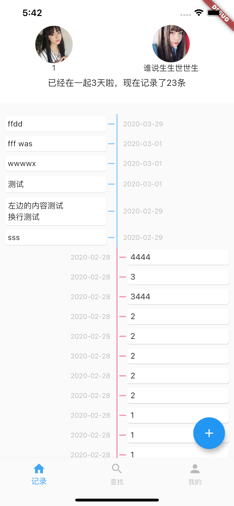
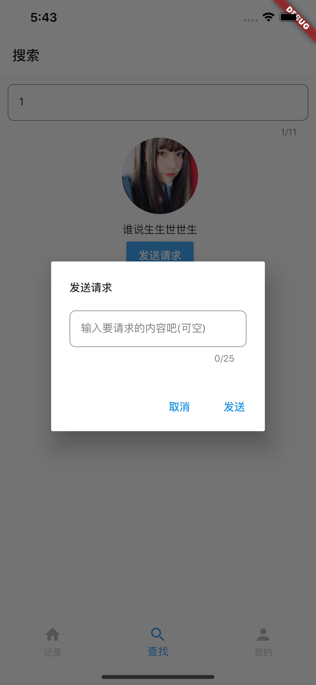
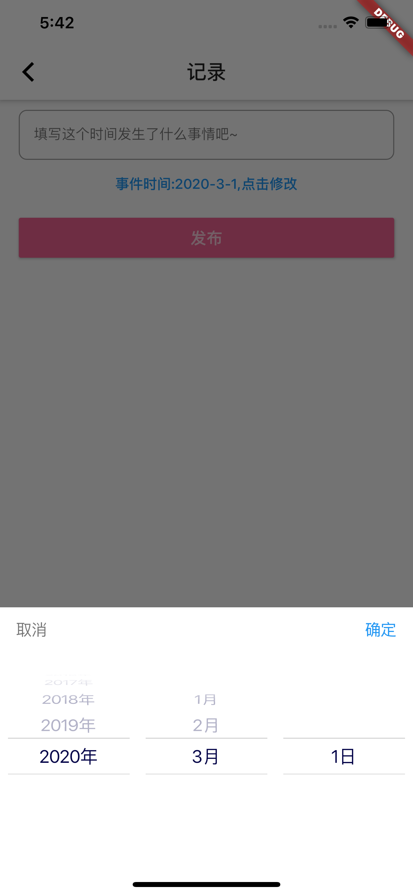
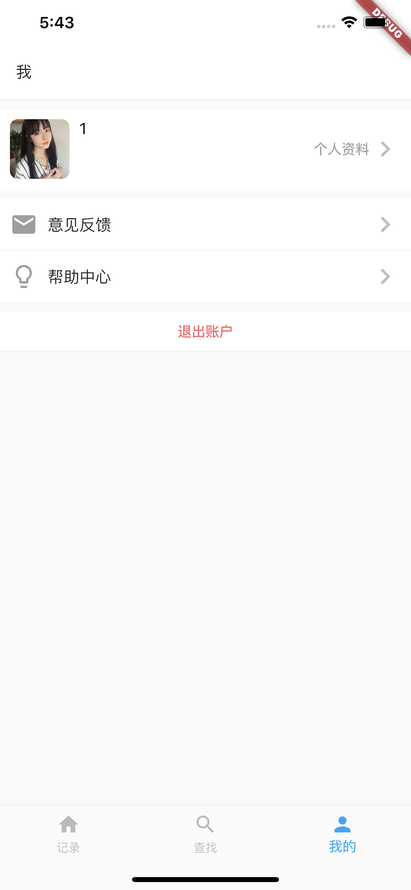

# Record(记录)

> 两人使用的时间事件记录app

## 最新动态
### 该项目主要功能已经完成
> 主要是绑定和记录事件

### 已经完成的功能
> 事件的记录和显示 根据事件时间排序 根据对应的人进行左右分开显示

> 登陆 登出的功能(注册和忘记密码可以移步至项目[accompany](https://github.com/sohyunQVQ/flutter-accompany)进行参考)

> 修改头像 / 修改资料

> 搜索用户 发出连接 收到连接 连接时的处理

> 后端用的thinkphp6+mysql 仅用于增删改查的处理 一般自己编译存储使用是可以的。

### 已经完成界面

<table>
  <tbody>
    <tr>
      <td align="center" width="200" valign="top">
        
      </td>
      <td align="center" width="200" valign="top">
        
      </td>
      <td align="center" width="200" valign="top">
        
      </td>
      <td align="center" width="200" valign="top">
        
      </td>
        <td align="center" width="200" valign="top">
          
        </td>
     </tr>
  </tbody>
</table>

## 运行方式
- 在thinkphp6_server/record打开终端运行 ``` php think run ```
- 修改所有本地地址(192.168.1.5:8000)修改成你的服务(注意不要使用localhost｜127.0.0.1)
- 运行启动您的应用
```dart
  flutter packages get
  flutter run
```

## 开发和调试环境
用的是Mac自带的ios模拟器(Iphone 11 Pro Max)开发 已经尽力适配不同分辨率的处理了;

## 新手文档参考

### [Flutter Go](https://github.com/alibaba/flutter-go/)

## 如果有其他问题,可联系交流
abigeater@163.com
